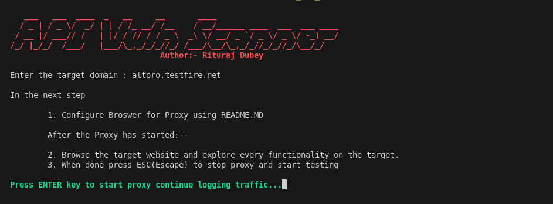
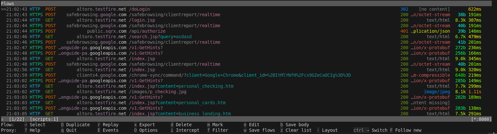
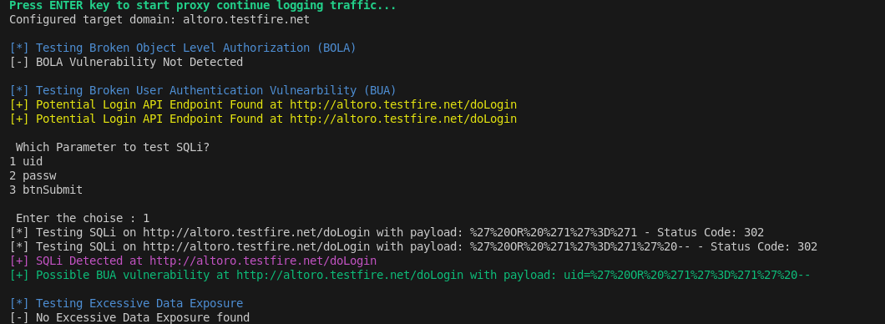

## Configure Browser before running this tool
**Author :** Rituraj Dubey
* * *

                                        How to Use the Tool
To use the API Vulnerability Testing Tool, follow these steps:
1. Setup Proxy: 

Install the Mitmproxy CA Certificate in the Browser to log HTTPS traffic as well as HTTP traffic.

Install FoxyProxy Extension in the Browser and Configure it to point to the MITMPROXY which is operating at 127.0.0.1:8080 by default.

● Clone This Repo

● Install all the requirement of the tool by using pip3 install -r requirements.txt

● Run python3 main.py

● Enter Target domain name

● Explore Target Website:

● - Interact with the target website, navigating through its functionalities to log requests.

● When done, press the ESC (Escape) key to stop the proxy and initiate vulnerability testing by using "esc" and press "y" to run the scan
